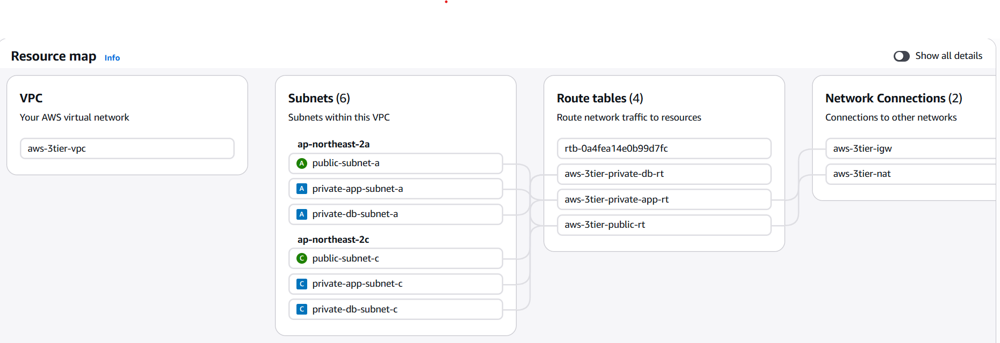
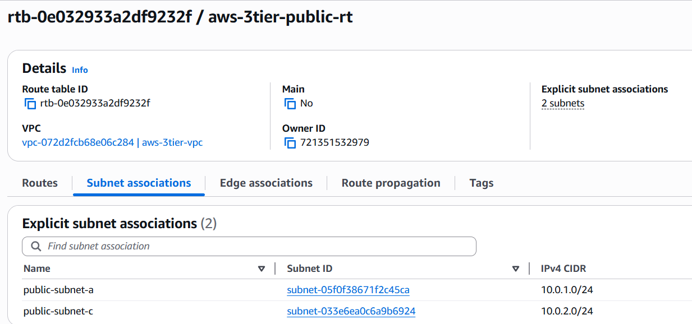
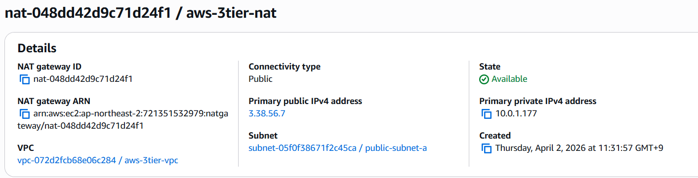

# VPC Network 구성 (Phase 1)

## 1. 작업 목적

3-Tier 아키텍처 구축을 위한 네트워크 환경 구성
VPC, Subnet, Gateway, Route Table을 구성하여 계층별 네트워크를 분리한다.

---

## 2. 구성 내용

* VPC 생성
* Subnet 구성 (Public / Private-App / Private-DB)
* Internet Gateway 연결
* NAT Gateway 생성
* Route Table 구성 및 Subnet 연결

---

## 3. 작업 과정

### Step 1. VPC 생성

목적

* 네트워크 전체 범위 정의

설정

* Name: aws-3tier-vpc
* CIDR: 10.0.0.0/16

---

### Step 2. Subnet 구성

목적

* 계층별 네트워크 분리 및 AZ 기반 고가용성 확보

설정

* public-subnet-a: 10.0.1.0/24 (AZ-a)

* public-subnet-c: 10.0.2.0/24 (AZ-c)

* private-app-subnet-a: 10.0.11.0/24 (AZ-a)

* private-app-subnet-c: 10.0.12.0/24 (AZ-c)

* private-db-subnet-a: 10.0.21.0/24 (AZ-a)

* private-db-subnet-c: 10.0.22.0/24 (AZ-c)

---

### Step 3. Internet Gateway 연결

목적

* Public Subnet의 외부 인터넷 통신 허용

설정

* IGW: aws-3tier-igw 생성
* aws-3tier-vpc에 연결

연결

* VPC ↔ Internet Gateway 연결 완료

---

### Step 4. Public Route Table 구성

목적

* Public Subnet을 인터넷과 연결

설정

* Route Table: public-rt 생성

* Route 추가:

  * 0.0.0.0/0 → Internet Gateway

연결

* public-subnet-a
* public-subnet-c

---

### Step 5. NAT Gateway 생성

목적

* Private App Subnet의 외부 통신 지원

설정

* NAT 이름: aws-3tier-nat
* 배치 서브넷: public-subnet-a
* Connectivity type: Public
* Elastic IP 연결 완료
* 상태: Available

연결

* private-app-rt에 NAT Gateway 연결
* private-app-subnet-a, private-app-subnet-c에 적용

---

### Step 6. Private App Route Table 구성

목적

* App 서버의 외부 통신 경로 설정

설정

* Route Table: private-app-rt 생성

* Route 추가:

  * 0.0.0.0/0 → NAT Gateway

연결

* private-app-subnet-a
* private-app-subnet-c

---

### Step 7. Private DB Route Table 구성

목적

* DB 서버 외부 접근 차단

설정

* Route Table: private-db-rt 생성
* 외부 인터넷 경로 없음

연결

* private-db-subnet-a
* private-db-subnet-c

---

## 4. 설정 값 정리

### VPC

* CIDR: 10.0.0.0/16

### Subnet

* public-subnet-a: 10.0.1.0/24

* public-subnet-c: 10.0.2.0/24

* private-app-subnet-a: 10.0.11.0/24

* private-app-subnet-c: 10.0.12.0/24

* private-db-subnet-a: 10.0.21.0/24

* private-db-subnet-c: 10.0.22.0/24

---

## 5. 결과 확인

### VPC 전체 구조

👉 VPC, Subnet, IGW 연결 구조 확인

---

### Route Table 구성

👉 Public Subnet → IGW 연결  
👉 Private App Subnet → NAT Gateway 연결
👉 Private-DB → 외부 경로 없음

---

### NAT Gateway 상태

👉 Private Subnet의 외부 통신 경로 확인

---

## 6. 설계 기준

* 2개의 AZ를 사용하여 고가용성 확보
* Public / Private Subnet 분리를 통한 보안 구조 설계
* App 계층은 NAT Gateway를 통해 외부 통신
* DB 계층은 외부 접근 차단

---

## 📌 정리

* Public Subnet → Internet Gateway 연결
* Private App Subnet → NAT Gateway 연결
* Private DB Subnet → 외부 차단

네트워크 레벨에서 3-Tier 구조 분리 완료

