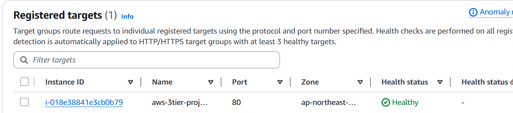
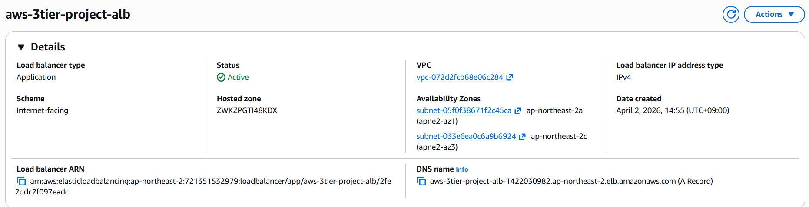
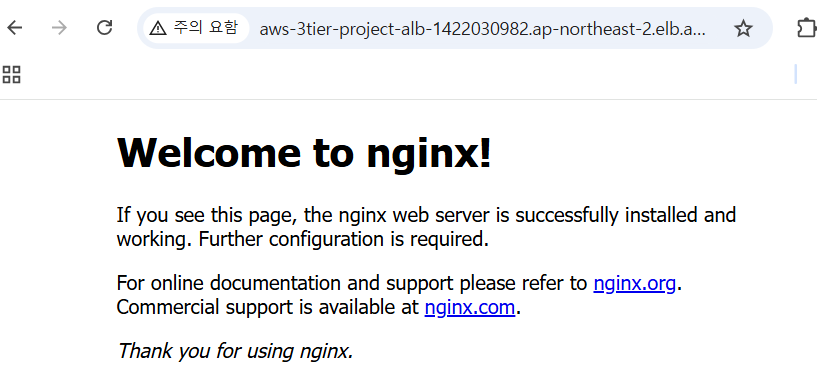

# ALB + EC2 구성 (Web Layer)

## 1. 작업 목적

Public Load Balancer(ALB)를 통해 Private Subnet에 위치한 EC2에 접근 가능한 구조 구성
Bastion Host를 이용하여 Private EC2에 접속하고 웹 서버를 구성한다.
또한 Auto Scaling을 통해 다중 서버 환경과 고가용성을 확보한다.

---

## 2. 구성 내용

* Security Group 설계
* Bastion Host 생성
* Private App EC2 생성
* Bastion을 통한 SSH 접속
* nginx 설치 및 실행
* Target Group 생성
* ALB 생성 및 연결
* Health Check 확인
* Auto Scaling 구성 (확장)

---

## 3. 작업 과정

### Step 1. Security Group 구성

목적

* ALB와 EC2 간의 HTTP 통신 및 SSH 접근 경로 설정

설정

**alb-sg**

* 이름: aws-3tier-project-alb-sg
* Inbound

  * HTTP (80) → 0.0.0.0/0

**app-ec2-sg**

* 이름: aws-3tier-project-app-ec2-sg
* Inbound

  * HTTP (80) → alb-sg
  * SSH (22) → bastion-sg

**bastion-sg**

* 이름: aws-3tier-project-bastion_host-launch-wizard-1
* Inbound

  * SSH (22) → My IP

연결

* ALB ↔ alb-sg
* EC2 ↔ app-ec2-sg
* Bastion ↔ bastion-sg

---

### Step 2. Bastion Host 생성

목적

* Private EC2에 SSH 접속을 위한 중간 서버 구성

설정

* Name: bastion-host
* Subnet: public-subnet-a
* Public IP: Enable
* Security Group: bastion-sg
* Key Pair: 기존 키 사용

연결

* 외부 → Bastion (SSH)

---

### Step 3. App EC2 생성

목적

* 웹 서버 역할의 EC2를 Private Subnet에 배치

설정

* Name: app-server-1
* Subnet: private-app-subnet-a
* Public IP: 없음
* Security Group: app-ec2-sg
* Key Pair: bastion과 동일

연결

* Bastion → EC2 (SSH)
* ALB → EC2 (HTTP)

---

### Step 4. Bastion을 통한 EC2 접속

목적

* Private EC2에 직접 접근이 불가능하므로 Bastion을 통해 접속

설정

```bash
ssh -i my-key.pem ubuntu@<BASTION_PUBLIC_IP>
```

```bash
ssh -i my-key.pem ubuntu@<PRIVATE_IP>
```

연결

* Local → Bastion → Private EC2

---

### Step 5. nginx 설치 및 실행

목적

* EC2에서 웹 서비스 제공

설정

```bash
sudo apt update
sudo apt install nginx -y
sudo systemctl start nginx
sudo systemctl enable nginx
```

확인

```bash
curl localhost
```

연결

* EC2 내부에서 HTTP 서비스 실행

---

### Step 6. Target Group 생성

목적

* ALB가 트래픽을 전달할 대상 정의

설정

* Target type: Instance

* Protocol: HTTP

* Port: 80

* VPC: aws-3tier-vpc

* Health Check

  * Path: /

* 등록 대상

  * app-server-1 추가

연결

* Target Group → EC2 연결

---

### Step 7. ALB 생성

목적

* 외부 트래픽을 받아 EC2로 전달하는 진입점 구성

설정

* Name: aws-3tier-alb

* Scheme: internet-facing

* Subnet

  * public-subnet-a
  * public-subnet-c

* Security Group

  * alb-sg

* Listener

  * HTTP 80 → Target Group 연결

연결

* Internet → ALB → Target Group → EC2

---

### Step 8. Health Check 확인

목적

* EC2가 정상적으로 트래픽을 처리하는지 검증

확인

* Target Group 상태: healthy
* ALB DNS 접속 시 nginx 페이지 정상 출력

---

## 3-1. Auto Scaling 확장 

### Step 9. Launch Template 생성

목적

* 동일한 EC2를 자동으로 생성하기 위한 템플릿 정의

설정

* AMI: Ubuntu 22.04

* Instance type: t2.micro

* Security Group: app-ec2-sg

* Key Pair: 기존 키 사용

* User Data

```bash
#!/bin/bash
apt update
apt install nginx -y
systemctl start nginx
systemctl enable nginx
```

---

### Step 10. Auto Scaling Group 생성

목적

* EC2 인스턴스를 자동으로 생성 및 관리하여 가용성 확보

설정

* VPC: aws-3tier-vpc

* Subnet:

  * private-app-subnet-a
  * private-app-subnet-c

* Target Group 연결

  * app-tg

* Capacity

  * Desired: 2
  * Min: 1
  * Max: 3

연결

* ASG → Target Group → ALB

---

### Step 11. Load Balancing 확인

목적

* 다중 EC2 환경에서 트래픽 분산 확인

방법

* ALB DNS 접속 후 새로고침 반복
* 각 EC2 HTML 내용 다르게 설정

결과

* 요청이 여러 EC2로 분산됨 확인

---

### Step 12. Auto Scaling 테스트

목적

* 장애 발생 시 자동 복구 확인

방법

* EC2 인스턴스 1개 종료

결과

* 새로운 EC2 자동 생성
* Target Group 자동 등록 및 healthy 유지

---

## 4. 설정 값 정리

### EC2

* private-app-subnet-a / c
* Public IP 없음
* Port: 80

### ALB

* internet-facing
* public subnet 2개 사용

### Target Group

* HTTP 80
* Health Check: /

### Auto Scaling

* Desired: 2
* Min: 1
* Max: 3

---

## 5. 결과 확인

### Target Group 상태



👉 EC2 인스턴스 healthy 상태 확인

---

### ALB 구성



👉 Public Subnet 기반 Load Balancer 확인

---

### ALB 접속 결과



👉 nginx 웹 페이지 정상 출력

---

## 6. 설계 기준

* EC2는 Private Subnet에 배치하여 외부 직접 접근 차단
* ALB를 통해서만 EC2 접근 가능하도록 구성
* Bastion Host를 이용한 안전한 SSH 접속 구조 적용
* Security Group을 통해 최소한의 접근만 허용
* Auto Scaling을 통해 고가용성 확보

---

## 📌 최종 정리

* Internet → ALB → Target Group → EC2 구조 구성 완료
* Private EC2는 직접 접근 불가
* Bastion Host를 통해 관리 접근 수행
* Auto Scaling을 통해 다중 서버 환경 및 장애 대응 가능

👉 Web Layer + 확장(High Availability) 구조 완성

