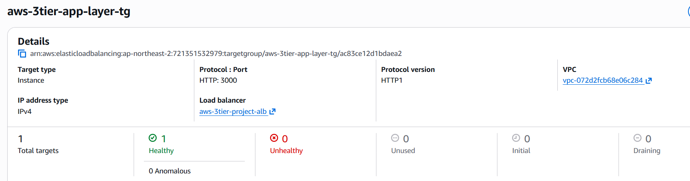
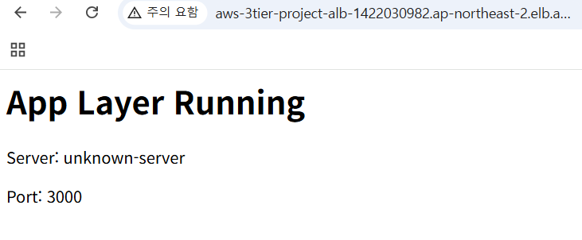

# App Layer 구성 (Node.js + ALB)

## 1. 작업 목적

인터넷에서 들어오는 요청을 ALB를 통해 수신하고, 이를 Target Group을 거쳐 Private Subnet에 위치한 App EC2로 전달하여 애플리케이션 레벨의 처리를 수행하는 구조를 구성했다.  
Node.js 기반 애플리케이션 서버를 구축하고, Health Check를 통해 정상 상태의 인스턴스에만 트래픽을 전달하도록 설계하였다.  
이를 통해 Web Layer와 App Layer를 분리하고, 실제 서비스 환경과 유사한 구조를 구현하는 것을 목표로 한다.

---

## 2. 구성 내용

- Node.js / Express 설치
- 애플리케이션 서버 실행 (포트 3000)
- Security Group 포트 확장
- App 전용 Target Group 생성
- ALB → App Layer 연결
- Health Check 구성 (/health)

---

## 3. 작업 과정

### Step 1. Security Group 수정

목적

- ALB에서 전달되는 트래픽이 애플리케이션 서버의 실행 포트(3000)에 도달할 수 있도록 접근 경로를 확장한다.
- 외부 직접 접근은 차단하고, Load Balancer를 통해서만 내부 서버에 접근하도록 보안 구조를 유지한다.

설정

**app-ec2-sg**

- Inbound
  - Custom TCP 3000 → alb-sg
  - SSH 22 → bastion-sg

연결

- ALB → EC2 (Port 3000)

---

### Step 2. Node.js 설치

목적

- 애플리케이션 서버 실행을 위한 런타임 환경을 구성한다.
- 기존 nginx 기반 구조에서 애플리케이션 로직 처리 구조로 확장하기 위한 기반을 마련한다.

설정

    sudo apt update
    sudo apt install nodejs npm -y

확인

    node -v
    npm -v

---

### Step 3. Express 애플리케이션 생성

목적

- HTTP 요청을 직접 처리하는 애플리케이션 서버를 구성한다.
- Web Layer와 App Layer의 역할을 분리하고, 동적인 요청 처리 구조를 만든다.

설정

    mkdir app-layer
    cd app-layer
    npm init -y
    npm install express

---

### Step 4. 애플리케이션 코드 작성

목적

- 클라이언트 요청에 대해 실제 응답을 반환하는 로직을 구현한다.
- Health Check를 위한 `/health` 엔드포인트를 구성하여 Load Balancer가 서버 상태를 판단할 수 있도록 한다.

설정

    const express = require("express");
    const app = express();

    const PORT = 3000;

    app.get("/", (req, res) => {
      res.send("<h1>App Layer Running</h1>");
    });

    app.get("/health", (req, res) => {
      res.status(200).send("OK");
    });

    app.listen(PORT, "0.0.0.0", () => {
      console.log(`App listening on port ${PORT}`);
    });

---

### Step 5. 애플리케이션 실행

목적

- Node.js 애플리케이션을 백그라운드에서 실행하여 서비스가 지속적으로 유지되도록 한다.
- SSH 연결 종료와 관계없이 애플리케이션이 계속 동작하도록 구성한다.

설정

    nohup node app.js > app.log 2>&1 &

확인

    curl localhost:3000
    curl localhost:3000/health

---

### Step 6. Target Group 생성

목적

- ALB가 애플리케이션 서버로 트래픽을 전달할 수 있도록 대상 그룹을 정의한다.
- 애플리케이션 포트와 Health Check를 기반으로 서버 상태를 관리한다.

설정

- Name: aws-3tier-app-layer-tg
- Protocol: HTTP
- Port: 3000
- Health Check Path: /health

연결

- Target Group → EC2 (Port 3000)

---

### Step 7. EC2 등록

목적

- 애플리케이션 서버를 Target Group에 등록하여 트래픽 전달 대상에 포함시킨다.
- Load Balancer와 애플리케이션 서버 간 연결을 완성한다.

설정

- Instance: app-server-1
- Port: 3000

---

### Step 8. ALB 연결

목적

- 외부 요청을 애플리케이션 서버로 전달하도록 Load Balancer의 라우팅 대상을 변경한다.
- nginx 기반 Web Layer에서 Node.js 기반 App Layer로 트래픽 흐름을 전환한다.

설정

- HTTP 80 → app-layer-tg

연결

- Internet → ALB → App EC2

---

### Step 9. Health Check 확인

목적

- 애플리케이션 서버가 정상적으로 동작하는지 검증한다.
- 비정상 인스턴스를 자동으로 제외하는 구조가 정상적으로 작동하는지 확인한다.

확인

- Target Group 상태: healthy

---

## 4. 설정 값 정리

### EC2

- private-app-subnet-a
- Public IP 없음
- Port: 3000

### ALB

- HTTP 80 → app-layer-tg

### Target Group

- Protocol: HTTP
- Port: 3000
- Health Check: /health

---

## 5. 결과 확인

### Target Group 상태

👉 App 서버 healthy 상태 확인

---

### ALB 접속 결과

👉 브라우저 접속 시 App Layer Running 페이지 출력

---

## 6. 설계 기준

- 애플리케이션 서버는 Private Subnet에 배치하여 외부 직접 접근 차단
- ALB를 통해서만 애플리케이션 서버에 접근 가능하도록 구성
- Security Group을 통해 최소한의 포트만 허용
- Health Check를 통해 정상 인스턴스만 트래픽 처리

---

## 📌 최종 정리

    Internet → ALB → Target Group → App EC2

- Web Layer → App Layer로 구조 확장 완료
- 애플리케이션 레벨의 요청 처리 구조 구현
- Load Balancer 기반 트래픽 전달 구조 이해

👉 3-Tier 구조의 App Layer 구성 완료
