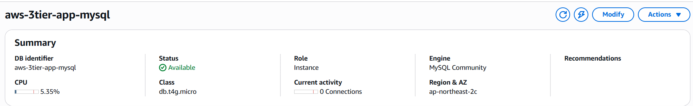
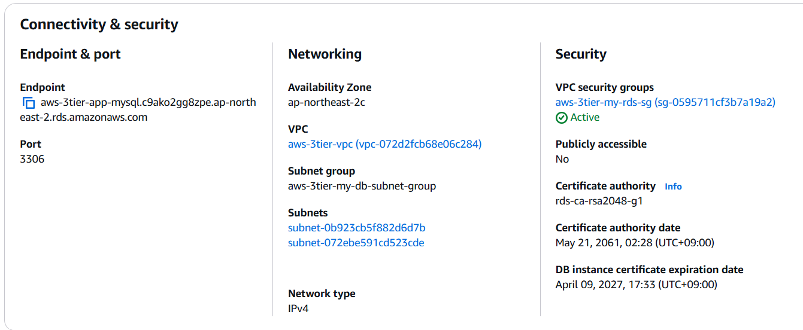
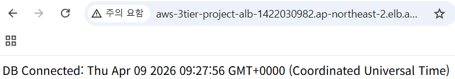

# DB Layer 구축 (RDS MySQL 연동)

## 1. 작업 목적

이번 단계의 목적은 App Layer 뒤에 DB Layer를 추가하여 AWS 3-Tier 아키텍처를 완성하는 것이다.

기존 구조:

Internet → ALB → Target Group → App EC2 (Node.js)

확장 구조:

Internet → ALB → Target Group → App EC2 (Node.js) → RDS (MySQL)

이번 단계에서는 단순히 DB를 생성하는 것이 아니라, 다음을 중점적으로 확인하였다.

- DB를 Private Subnet에 배치하는 이유
- App Layer만 DB에 접근하도록 제한하는 방법
- Node.js 애플리케이션과 RDS 연결
- ALB를 통한 전체 흐름 검증

즉, “구성”이 아니라 “설계 이유까지 포함한 구조 이해”를 목표로 진행하였다.

## 2. 구성 내용

### 사용 리소스

- VPC: aws-3tier-vpc
- DB Subnet Group: aws-3tier-my-db-subnet-group
- RDS Security Group: aws-3tier-my-rds-sg
- DB Name: aws-3tier-app-mysql

### 전체 구조

- Public Subnet
  - ALB
  - Bastion Host

- Private App Subnet
  - App EC2 (Node.js, Port 3000)

- Private DB Subnet
  - RDS (MySQL)

### 요청 흐름

- 사용자 요청 → ALB
- ALB → Target Group → App EC2
- App EC2 → RDS (쿼리 요청)
- RDS → App EC2 → 사용자 응답

### 접근 흐름

- 로컬 → Bastion Host → Private App EC2

즉, App 서버와 DB는 모두 외부에 직접 노출되지 않는 구조이다.

## 3. 작업 과정

### Step 1. DB Subnet 및 Route Table 구성 (기존 구성 활용)

Phase 1에서 VPC, Subnet, Route Table 구성을 이미 완료했기 때문에  
DB Layer에서는 기존 Private Subnet 구조를 그대로 활용하였다.

- DB는 별도의 Public 접근이 필요 없음
- 기존 Private Subnet을 DB Layer로 활용

👉 신규 생성이 아닌 기존 네트워크 구조 재사용

### Step 2. RDS Security Group 생성

#### 목적
DB는 아무 서버나 접근할 수 있게 열어두는 것이 아니라, App EC2만 접근 가능하도록 제한해야 한다.  
따라서 RDS 전용 Security Group을 만들고, 인바운드 소스를 App EC2의 Security Group으로 지정하였다.

#### 설정

- Name: aws-3tier-my-rds-sg
- Port: 3306
- Source: App EC2 Security Group

#### 핵심 포인트

- CIDR이 아닌 Security Group 기반 접근 제어
- App Layer만 DB 접근 가능
- Auto Scaling 환경에서도 일관성 유지 가능

### Step 3. DB Subnet Group 생성

#### 목적
RDS가 배치될 Subnet 영역을 정의

#### 설정

- Name: aws-3tier-my-db-subnet-group
- VPC: aws-3tier-vpc
- Subnet:
  - Private Subnet (AZ 2개)

#### 핵심 포인트

- 최소 2개 AZ 필수
- DB는 반드시 Private Subnet에 배치

### Step 4. RDS MySQL 생성

#### 목적
App Layer에서 사용할 DB 인스턴스 생성

#### AWS 콘솔 경로
RDS → Databases → Create database

#### 설정

- DB Identifier: aws-3tier-app-mysql
- Engine: MySQL
- VPC: aws-3tier-vpc
- Subnet Group: aws-3tier-my-db-subnet-group
- Public Access: No
- Security Group: aws-3tier-my-rds-sg
- Port: 3306

---

📸 **RDS 상태 (Available)**

---

📸 **RDS Endpoint 확인**

👉 해당 Endpoint를 Node.js에서 사용

### Step 5. App EC2에서 RDS 직접 접속 확인

#### 목적
애플리케이션 코드 문제와 네트워크 문제를 분리하기 위함

#### 접속 흐름
로컬 PC → Bastion Host → Private App EC2

#### 실행

    sudo apt update
    sudo apt install mysql-client -y

    mysql -h <RDS-ENDPOINT> -P 3306 -u admin -p

#### 결과

- 접속 성공 → 네트워크 및 보안 설정 정상

👉 CLI 접속이 되면 최소한 인프라 문제는 없음

### Step 6. Node.js DB 연결 설정

#### 1) mysql2 설치

    cd ~/app-layer
    npm install mysql2

---

#### 2) db.js 생성

    const mysql = require("mysql2/promise");

    const pool = mysql.createPool({
      host: "RDS-ENDPOINT",
      port: 3306,
      user: "admin",
      password: "비밀번호",
      database: "appdb",
      waitForConnections: true,
      connectionLimit: 10
    });

    module.exports = pool;

---

#### 3) app.js 수정

    const express = require("express");
    const pool = require("./db");
    
    const app = express();
    const PORT = 3000;
    const SERVER_NAME = process.env.SERVER_NAME || "unknown-server";
    
    app.get("/", (req, res) => {
      res.send(`
        <h1>App Layer Running</h1>
        
Server: ${SERVER_NAME}

        
Port: ${PORT}

      `);
    });
    
    app.get("/db-test", async (req, res) => {
      try {
        const [rows] = await pool.query("SELECT NOW() AS now");
        res.send(`DB Connected: ${rows[0].now}`);
      } catch (error) {
        console.error(error);
        res.status(500).send("DB connection failed");
      }
    });
    
    app.listen(PORT, "0.0.0.0", () => {
      console.log(`App listening on port ${PORT}`);
    });

#### 목적
Node.js 앱이 실제로 RDS와 통신하는지 확인하기 위해 DB 테스트용 라우트를 추가하였다.

#### 핵심 포인트

- db.js로 DB 설정 분리
- app.js는 요청 처리만 담당
- 구조 분리 → 유지보수 용이

### Step 7. Node.js 앱 재실행

#### 목적
수정한 app.js와 db.js 내용을 반영하기 위해 기존 프로세스를 종료하고 애플리케이션을 재실행하였다.

#### 프로세스 확인
    ps -ef | grep node

#### 기존 프로세스 종료
    kill <PID>

필요 시 강제 종료:
    kill -9 <PID>

#### 다시 실행
    node app.js

#### 연결
애플리케이션이 Port 3000에서 다시 실행되며, /db-test 라우트가 반영된 상태가 된다.

### Step 8. 애플리케이션 실행 및 내부 테스트

#### 실행

    node app.js

#### 확인

    curl http://localhost:3000
    curl http://localhost:3000/db-test

#### 결과

- App Layer 정상 응답
- DB 연결 성공

👉 Node.js ↔ RDS 연결 확인 완료

### Step 9. ALB DNS로 최종 검증

📸 **ALB → DB 연결 결과**

#### 결과

- ALB → App → DB 흐름 정상 동작

👉 외부 사용자 요청이 DB까지 전달됨

## 4. 설정 값 정리

- VPC: aws-3tier-vpc
- DB Subnet Group: aws-3tier-my-db-subnet-group
- RDS SG: aws-3tier-my-rds-sg
- DB Name: aws-3tier-app-mysql
- DB Port: 3306
- App Port: 3000

보안 설정:

- RDS Public Access: No
- DB 접근: App EC2만 허용

## 5. 결과 확인

- RDS 생성 및 상태 정상
- EC2 → RDS 직접 접속 성공
- Node.js → RDS 연결 성공
- ALB DNS → DB 응답 확인

최종 구조:

Internet → ALB → App EC2 → RDS

## 6. 설계 기준

### 1) DB를 Private Subnet에 둔 이유

DB는 외부 사용자에게 직접 노출될 필요가 없다.  
App Layer를 통해서만 접근하도록 제한하여 보안을 강화하였다.

---

### 2) Public Access를 비활성화한 이유

DB를 인터넷에 노출하지 않기 위함이다.  
공격 표면을 최소화하는 것이 핵심이다.

---

### 3) Security Group을 App 기준으로 제한한 이유

IP가 아닌 Security Group 기반으로 제어하면  
“어떤 계층이 접근 가능한지” 구조적으로 명확해진다.

---

### 4) DB Subnet Group을 사용하는 이유

RDS는 단일 Subnet이 아닌 Subnet 그룹 기준으로 배치된다.  
이를 통해 AZ 분산 구조 및 고가용성 기반을 확보할 수 있다.

---

## 7. 최종 정리

이번 단계에서 DB Layer 구축과 App Layer 연동을 완료하였다.

핵심 흐름:

- RDS Private 배치
- App → DB 연결 성공
- ALB → App → DB 전체 흐름 검증 완료

다음 단계:

- CRUD 구현
- .env 적용
- DB 구조 설계
- 운영 관점 정리

## 환경 변수 (.env) 적용!!!

### 목적

DB 접속 정보와 같은 민감한 데이터를 코드에서 분리하기 위해 .env 파일을 적용하였다.

---

### 적용 이유

- DB 비밀번호 코드 하드코딩 방지
- GitHub 업로드 시 보안 유지
- 설정과 코드 분리 (운영 환경 대응)

---

### 적용 방법

.env 파일 생성

    DB_HOST=RDS-ENDPOINT
    DB_USER=admin
    DB_PASSWORD=비밀번호
    DB_NAME=appdb
    DB_PORT=3306

db.js 수정

    require("dotenv").config();

    const pool = mysql.createPool({
      host: process.env.DB_HOST,
      user: process.env.DB_USER,
      password: process.env.DB_PASSWORD,
      database: process.env.DB_NAME,
      port: process.env.DB_PORT
    });

---

### 주의사항

- .env 파일은 GitHub에 업로드하지 않도록 .gitignore에 추가
- 민감 정보는 코드에 직접 작성하지 않는다

---

### 배운 점

- 애플리케이션과 설정을 분리하는 것이 중요하다
- 보안은 코드가 아니라 구조에서 관리해야 한다
