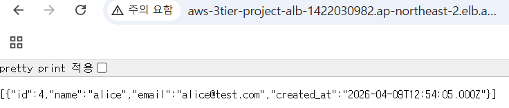
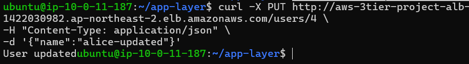

# End-to-End Test (전체 흐름 검증)

## 1. 작업 목적

이번 단계의 목적은 AWS 3-Tier 아키텍처에서  
전체 요청 흐름이 정상적으로 동작하는지 검증하는 것이다.

단순히 각 계층이 개별적으로 동작하는 것이 아니라,

Internet → ALB → App EC2 → RDS → 응답 반환

이 전체 흐름이 하나의 서비스로 연결되어 동작하는지를 확인하였다.

---

## 2. 테스트 환경

- Web Layer: ALB (Public Subnet)
- App Layer: EC2 (Node.js, Private Subnet)
- DB Layer: RDS MySQL (Private Subnet)

접속 기준:

    http://<ALB-DNS>

---

## 3. 애플리케이션 수정 (app.js)

### 목적

외부 요청을 받아 DB에 데이터를 처리하기 위해  
CRUD API를 구현하였다.

### 주요 수정 내용

- JSON 요청 처리를 위한 middleware 추가
- DB 연결(db.js) 사용
- CRUD API 구현

### 코드

    const express = require("express");
    const pool = require("./db");

    const app = express();
    app.use(express.json());

    const PORT = 3000;

    // CREATE
    app.post("/users", async (req, res) => {
      const { name, email } = req.body;

      try {
        await pool.query(
          "INSERT INTO users (name, email) VALUES (?, ?)",
          [name, email]
        );
        res.send("User created");
      } catch (err) {
        console.error(err);
        res.status(500).send("Error");
      }
    });

    // READ
    app.get("/users", async (req, res) => {
      try {
        const [rows] = await pool.query("SELECT * FROM users");
        res.json(rows);
      } catch (err) {
        console.error(err);
        res.status(500).send("Error");
      }
    });

    // UPDATE
    app.put("/users/:id", async (req, res) => {
      const { name } = req.body;
      const { id } = req.params;

      try {
        await pool.query(
          "UPDATE users SET name = ? WHERE id = ?",
          [name, id]
        );
        res.send("User updated");
      } catch (err) {
        console.error(err);
        res.status(500).send("Error");
      }
    });

    // DELETE
    app.delete("/users/:id", async (req, res) => {
      const { id } = req.params;

      try {
        await pool.query("DELETE FROM users WHERE id = ?", [id]);
        res.send("User deleted");
      } catch (err) {
        console.error(err);
        res.status(500).send("Error");
      }
    });

    app.listen(PORT, "0.0.0.0", () => {
      console.log(`Server running on port ${PORT}`);
    });

---

## 4. 테스트 과정

### 1) 조회 (초기 상태)

    curl http://<ALB-DNS>/users

→ 초기에는 빈 데이터 또는 기존 데이터 확인

---

### 2) 데이터 생성 (CREATE)

    curl -X POST http://<ALB-DNS>/users \
    -H "Content-Type: application/json" \
    -d '{"name":"alice","email":"alice@test.com"}'

📸 **Create 요청 실행**

---

### 3) 데이터 조회 (READ)

    curl http://<ALB-DNS>/users

📸 **웹에서 조회 결과**

→ 생성한 데이터 확인

---

### 4) 데이터 수정 (UPDATE)

    curl -X PUT http://<ALB-DNS>/users/1 \
    -H "Content-Type: application/json" \
    -d '{"name":"alice-updated"}'

📸 **Update 요청 실행**

---

### 5) 수정 결과 확인

    curl http://<ALB-DNS>/users

→ name 값 변경 확인

---

### 6) 데이터 삭제 (DELETE)

    curl -X DELETE http://<ALB-DNS>/users/1

---

### 7) 삭제 결과 확인

    curl http://<ALB-DNS>/users

→ 데이터 삭제 확인

---

## 5. 결과 확인

이번 테스트를 통해 다음을 확인하였다.

- ALB를 통해 외부 요청이 정상적으로 수신됨
- App EC2가 요청을 처리하고 DB와 통신함
- RDS에 데이터가 정상적으로 저장/조회/수정/삭제됨
- 전체 요청 흐름이 정상적으로 동작함

최종 흐름:

    Internet → ALB → App EC2 → RDS → App EC2 → ALB → User

---

## 6. 설계 관점

### 1) 계층 간 연결 확인

각 계층이 독립적으로 존재하는 것이 아니라  
실제로 연결되어 하나의 서비스로 동작함을 확인하였다.

---

### 2) App Layer 역할

- 요청 처리
- DB와 통신
- 응답 생성

→ 시스템의 핵심 로직 수행

---

### 3) DB Layer 역할

- 데이터 저장 및 관리
- App 요청에 따른 데이터 처리

→ 직접 외부와 통신하지 않음

---

## 📌 최종 정리

* End-to-End Test → 전체 서비스 흐름 검증
* ALB → 외부 요청 진입 지점
* App Layer → 요청 처리 및 DB 연동
* RDS → 데이터 저장 및 관리
* CRUD API → 서비스 기능 구현
* 전체 흐름 → Internet → ALB → App → RDS
