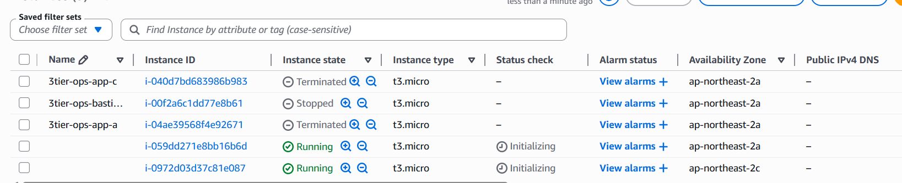
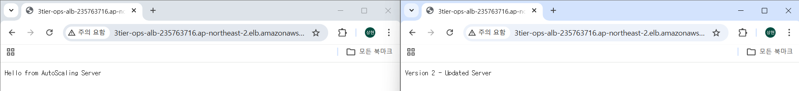

# Operations Enhancement (IAM + SSM + Auto Scaling + Instance Refresh)

## 1. 작업 목적

기존 3-Tier 구조는 서비스 기능 구현에 초점이 맞춰져 있었다.  
이번 단계에서는 운영 환경에서의 인프라 관리 및 배포 방식을 개선하는 것을 목표로 한다.

SSH 기반 접속 방식을 제거하고, AWS Systems Manager(Session Manager)를 활용한 안전한 접근 구조를 구성한다.  
또한 Launch Template과 Auto Scaling Group을 통해 인스턴스를 자동으로 생성하고, Instance Refresh를 통해 무중단 배포 구조를 구현한다.

이를 통해 실제 서비스 운영 환경과 유사한 자동화 및 배포 구조를 구성하는 것을 목표로 한다.

---

## 2. 구성 내용

- IAM Role 생성 및 EC2 적용
- SSM Session Manager 기반 접속 구성
- SSH 제거 및 Bastion Host 제거
- Launch Template 생성
- Auto Scaling Group 구성
- Instance Refresh 기반 무중단 배포

---

## 3. 작업 과정

### Step 1. IAM Role 생성

목적

- EC2 인스턴스가 AWS 서비스와 안전하게 통신할 수 있도록 권한을 부여한다.
- Session Manager를 통한 접속을 가능하게 하기 위한 최소 권한을 설정한다.

설정

- Role name: 3tier-ops-role-ec2-ssm
- Trusted entity: EC2

Policy

- AmazonSSMManagedInstanceCore

---

### Step 2. EC2에 IAM Role 적용

목적

- 기존 EC2 인스턴스에 SSM 접근 권한을 부여한다.
- SSH 없이 EC2에 접속 가능한 구조를 구성한다.

설정

- 대상 인스턴스:
  - 3tier-ops-app-a
  - 3tier-ops-app-c

경로

    EC2 → Instances → 선택 → Actions → Security → Modify IAM role

---

### Step 3. Session Manager 접속 확인

목적

- SSH 없이 Private EC2에 접근 가능한지 확인한다.
- Bastion Host 없이 운영 가능한 구조를 검증한다.

경로

    EC2 → Instance → Connect → Session Manager

확인

    접속 성공

---

### Step 4. 보안 구조 개선

목적

- SSH 기반 접근을 제거하여 공격 표면을 최소화한다.
- 운영 접근을 SSM으로 단일화한다.

설정

- App Security Group 수정

삭제

    SSH 22 → Bastion SG

---

### Step 5. Launch Template 생성

목적

- 인스턴스를 수동 생성이 아닌 자동 생성 구조로 전환한다.
- 동일한 설정으로 인스턴스를 반복 생성할 수 있도록 템플릿을 구성한다.

경로

    EC2 → Launch Templates → Create launch template

설정

- Name: 3tier-ops-lt-app
- IAM Role: 3tier-ops-role-ec2-ssm
- Security Group: 3tier-ops-sg-app

User Data

    #!/bin/bash
    apt update -y
    apt install -y nodejs npm

    cat <<EOF > /home/ubuntu/app.js
    const http = require('http');
    const server = http.createServer((req, res) => {
      res.end("Hello from AutoScaling Server");
    });
    server.listen(80);
    EOF

    node /home/ubuntu/app.js

---

### Step 6. Auto Scaling Group 생성

목적

- 인스턴스를 자동으로 생성 및 유지하는 구조를 구성한다.
- 장애 발생 시 자동 복구가 가능한 환경을 만든다.

경로

    EC2 → Auto Scaling Groups → Create

설정

- Name: 3tier-ops-asg-app
- Launch Template: 3tier-ops-lt-app

네트워크

- Subnets
  - 3tier-ops-app-a
  - 3tier-ops-app-c

로드 밸런서 연결

- Target Group: 3tier-ops-tg-app

용량

- Desired: 2
- Min: 2
- Max: 2

---

### Step 7. 기존 EC2 제거

목적

- 수동으로 생성된 인스턴스를 제거하고, ASG 기반 구조로 전환한다.

대상

    3tier-ops-app-a
    3tier-ops-app-c

---

### Step 8. Launch Template 버전 업데이트

목적

- 애플리케이션 변경 사항을 새로운 버전으로 반영한다.
- Instance Refresh를 통한 배포 테스트를 준비한다.

변경 내용

    res.end("Version 2 - Updated Server");

---

### Step 9. Instance Refresh 실행

목적

- 기존 인스턴스를 새로운 버전으로 교체한다.
- 서비스 중단 없이 업데이트를 수행한다.

경로

    EC2 → Auto Scaling Groups → Instance Refresh → Start

설정

- Minimum healthy percentage: 50
- Desired configuration:
  - Launch Template 최신 버전 지정

---

## 4. 설정 값 정리

### IAM

- Role: 3tier-ops-role-ec2-ssm

### Launch Template

- 3tier-ops-lt-app

### Auto Scaling Group

- 3tier-ops-asg-app

### Target Group

- 3tier-ops-tg-app

---

## 5. 결과 확인

### Session Manager 접속

👉 SSH 없이 Private EC2 접속 성공

---

### Auto Scaling 동작 확인

👉 인스턴스 2개 자동 생성 확인

---

### Instance Refresh 결과

👉 기존 버전 → 신규 버전으로 점진적 교체 확인

---

### 웹 응답 변화

👉 Version 1 / Version 2 응답 변화 확인

---

## 6. 설계 기준

- SSH 제거 및 Bastion Host 제거 → 보안 강화
- IAM Role 기반 접근 제어 → 최소 권한 원칙 적용
- Launch Template 기반 인스턴스 생성 → 일관성 유지
- Auto Scaling Group → 자동 복구 및 확장 가능 구조
- Instance Refresh → 무중단 배포 구현

---

## 📌 트러블슈팅

### Launch Template 변경이 반영되지 않는 문제

#### 문제 상황

- Launch Template Version 2 생성
- Instance Refresh 실행
- 웹 응답이 변경되지 않음

#### 원인

- Auto Scaling Group이 Launch Template의 default version 사용
- Instance Refresh 시 최신 버전이 아닌 기존 버전 기준으로 실행됨

#### 해결 방법

- ASG → Launch Template version → latest 변경
- Instance Refresh → desired configuration에서 최신 버전 지정

#### 결과

- Instance 교체 후 웹 응답 정상 변경

---

## 📌 최종 정리

    Before:
    수동 EC2 + SSH + Bastion 기반 운영

    After:
    ASG + SSM + Launch Template 기반 자동화 운영

- 운영 접근 방식 개선 (SSH → SSM)
- 인스턴스 자동화 구조 구축
- 무중단 배포 구조 구현

👉 운영 중심 인프라 구조로 확장 완료
