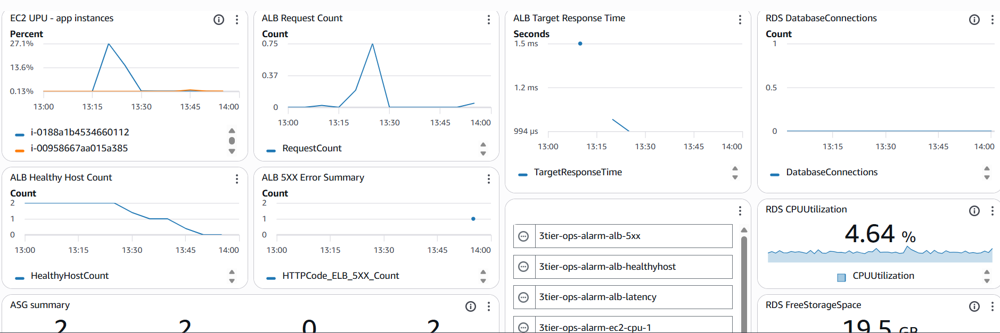

# CloudWatch 모니터링 및 알람 구성

## 1. 개요

지금까지 3-Tier 아키텍처를 구성하면서 서비스가 정상적으로 동작하는 것까지는 확인했다.  
하지만 실제 운영 환경에서는 현재 서비스 상태가 정상인지, 문제가 발생했는지를 지속적으로 확인할 수 있어야 한다.

이번 단계에서는 CloudWatch를 활용하여 인프라 상태를 실시간으로 모니터링하고,  
이상 상황이 발생했을 때 자동으로 감지할 수 있는 구조를 구성하였다.

단순히 그래프를 보는 것을 넘어서,  
어떤 지표를 통해 서비스 상태를 판단할 수 있는지 이해하는 것을 목표로 했다.

---

## 2. 이번 단계에서 수행한 내용

- CloudWatch Metrics 구조 확인
- 주요 리소스(EC2, ALB, RDS) 모니터링 지표 선정
- Dashboard 구성
- Alarm 설정
- 부하 테스트 및 장애 테스트 수행

---

## 3. Dashboard 구성 및 작업 과정

### Step 1. Metrics 확인

먼저 CloudWatch에서 어떤 데이터를 제공하는지 확인했다.  
처음에는 항목이 많아서 복잡하게 느껴졌지만, 실제로 필요한 지표는 제한적이었다.

이번 실습에서는 아래와 같은 핵심 지표 위주로 구성하였다.

- EC2 → CPUUtilization
- ALB → RequestCount, TargetResponseTime
- Target Group → HealthyHostCount
- RDS → DatabaseConnections, FreeStorageSpace

이 과정에서 모든 데이터를 보는 것이 아니라,  
서비스 상태를 판단할 수 있는 핵심 지표를 선별하는 것이 중요하다는 것을 알게 되었다.

---

### Step 2. Dashboard 생성

여러 리소스의 상태를 한 번에 확인하기 위해 Dashboard를 생성했다.

경로

    CloudWatch → Dashboards → Create dashboard

이름

    3tier-ops-dashboard

Dashboard를 구성하고 나니 각 리소스를 개별적으로 확인할 때보다  
전체 서비스 흐름을 한눈에 파악할 수 있어서 훨씬 직관적으로 이해할 수 있었다.

---

### Step 3. Dashboard 위젯 구성

#### EC2 CPUUtilization

서버의 CPU 사용량을 통해 현재 서버가 얼마나 부하를 받고 있는지를 확인할 수 있도록 구성하였다.  
부하 테스트를 진행했을 때 CPU 사용량이 실제로 상승하는 것을 보면서,  
이 지표가 서버 상태를 직접적으로 반영한다는 것을 확인할 수 있었다.

---

#### ALB RequestCount

Load Balancer로 들어오는 요청 수를 확인하기 위해 구성하였다.  
브라우저에서 새로고침을 반복했을 때 값이 증가하는 것을 통해  
사용자의 요청이 실제로 ALB까지 전달된다는 것을 확인할 수 있었다.

---

#### ALB TargetResponseTime

요청을 처리하는 데 걸리는 시간을 확인하기 위해 구성하였다.  
이 지표를 통해 단순한 동작 여부뿐만 아니라 서버의 응답 속도와 성능 상태를 함께 판단할 수 있다.

---

#### HealthyHostCount

정상적으로 동작 중인 서버의 개수를 확인하기 위해 구성하였다.  
실제로 서버 하나를 종료했을 때 값이 2에서 1로 감소하는 것을 확인하면서  
Load Balancer가 정상 서버만 선택해서 트래픽을 전달한다는 것을 이해할 수 있었다.

---

#### RDS DatabaseConnections

DB에 연결된 세션 수를 확인하기 위해 구성하였다.  
트래픽이 증가할 경우 DB 연결 수도 함께 증가할 수 있기 때문에  
DB 부하 상태를 판단하는 기준으로 사용할 수 있다.

---

#### RDS FreeStorageSpace

DB에 남아 있는 저장 공간을 확인하기 위해 구성하였다.  
운영 환경에서는 디스크 용량 부족이 서비스 장애로 이어질 수 있기 때문에  
사전에 감지할 수 있도록 모니터링 대상으로 설정하였다.

---

#### ASG Capacity Summary

Auto Scaling Group의 현재 상태를 직관적으로 확인하기 위해 Number 위젯으로 구성하였다.  
- `GroupDesiredCapacity`
- `GroupInServiceInstances`
- `GroupPendingInstances`
- `GroupTotalInstances`
 값을 통해 현재 인스턴스 상태를 한눈에 파악할 수 있도록 하였다.

특히 Instance Refresh 과정에서 Pending 값이 증가하는 것을 보면서  
인스턴스가 교체되는 흐름을 직접 확인할 수 있었다.

---

## 4. Alarm 설정

Dashboard를 통해 상태를 직접 확인할 수 있지만,  
운영 환경에서는 사람이 계속 모니터링할 수 없기 때문에  
이상 상황이 발생했을 때 자동으로 감지할 수 있도록 Alarm을 설정하였다.

---

### EC2 CPU Alarm

CPU 사용량이 일정 수준 이상 올라갈 경우 알림이 발생하도록 설정하여  
서버 과부하 상황을 자동으로 감지할 수 있도록 구성하였다.

---

### ALB 5XX Alarm

서버에서 에러가 발생하여 5XX 응답이 발생할 경우 알림이 발생하도록 설정하여  
사용자에게 영향을 주는 장애 상황을 빠르게 인지할 수 있도록 구성하였다.

---

### HealthyHostCount Alarm

정상적으로 동작 중인 서버 개수가 감소할 경우 알림이 발생하도록 설정하여  
서버 장애 발생 여부를 즉시 확인할 수 있도록 구성하였다.

---

### RDS DatabaseConnections Alarm

DB 연결 수가 일정 수준 이상 증가할 경우 알림이 발생하도록 설정하여  
DB 과부하 상황을 사전에 감지할 수 있도록 구성하였다.

---

### RDS FreeStorageSpace Alarm

DB의 남은 저장 공간이 일정 수준 이하로 감소할 경우 알림이 발생하도록 설정하여  
디스크 부족으로 인한 장애를 예방할 수 있도록 구성하였다.

---

### ALB TargetResponseTime Alarm

요청 처리 시간이 일정 수준 이상 증가할 경우 알림이 발생하도록 설정하여  
서버 응답 지연 및 성능 저하 상황을 감지할 수 있도록 구성하였다.

---

## 5. 결과 확인

### CPU 부하 테스트

stress 명령어를 사용하여 CPU 부하를 발생시킨 결과,  
CPU 사용량이 상승하고 설정한 알람이 정상적으로 동작하는 것을 확인할 수 있었다.

---

### 트래픽 테스트

브라우저에서 반복적으로 요청을 발생시킨 결과,  
RequestCount 값이 증가하면서 트래픽 흐름이 Dashboard에 반영되는 것을 확인할 수 있었다.

---

### 장애 테스트

특정 EC2 인스턴스에서 node 프로세스를 종료한 결과,  
HealthyHostCount 값이 감소했지만 서비스는 정상적으로 유지되었다.

이를 통해 Load Balancer가 정상 서버로 트래픽을 자동으로 우회한다는 것을 확인할 수 있었다.

---

### 전체 장애 테스트

모든 서버를 종료했을 경우 HealthyHostCount가 0이 되고  
5XX 에러가 발생하는 것을 확인하였다.

이를 통해 실제 사용자에게 영향을 주는 장애 상황을 확인할 수 있었다.

---

## 6. 확인한 점

단일 서버 구조에서는 서버 장애가 곧 서비스 중단으로 이어지지만,  
다중 인스턴스 구조에서는 일부 서버에 문제가 발생해도 서비스가 유지된다는 것을 확인할 수 있었다.

CloudWatch는 단순히 데이터를 보여주는 도구가 아니라  
서비스 상태를 판단할 수 있는 기준을 제공하는 역할을 한다는 것을 이해할 수 있었다.

또한 Alarm을 통해 사람이 직접 확인하지 않아도  
문제 발생 시 자동으로 감지할 수 있는 구조를 만들 수 있다는 점이 인상적이었다.

---

## 📌 최종 정리

이번 실습을 통해 Dashboard를 통해 상태를 확인하고,  
Alarm을 통해 이상 상황을 감지하며,  
Auto Scaling을 통해 장애 상황에서도 자동으로 복구되는 흐름을 이해할 수 있었다.

단순한 인프라 구축을 넘어  
운영 관점에서의 모니터링과 대응 구조를 직접 경험할 수 있었던 단계였다.

---

## 7. 스크린샷-결과

